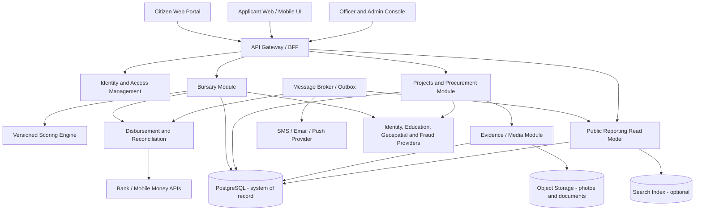
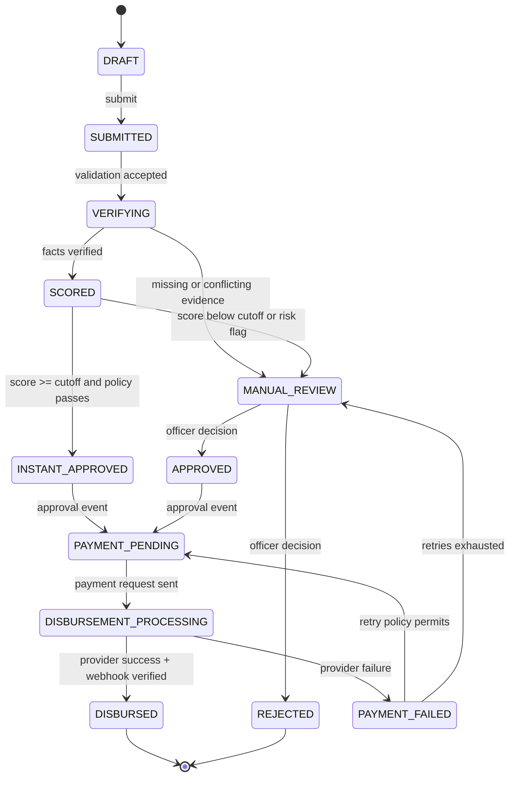
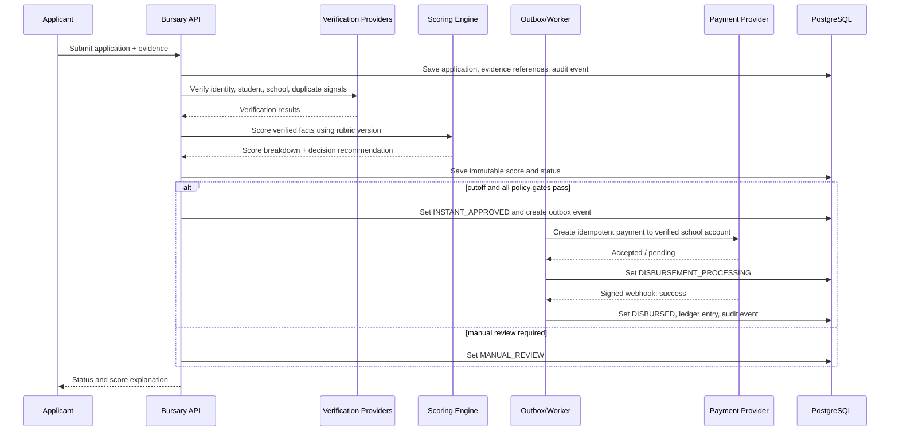
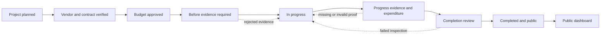
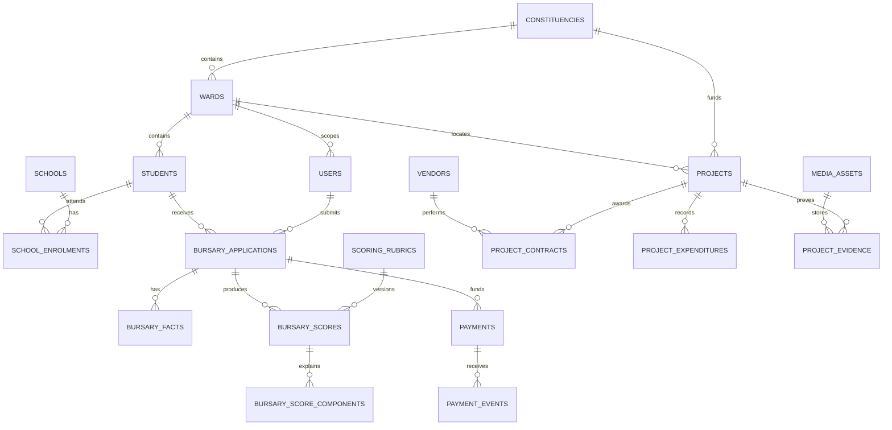

# CDF Management System
## System Architecture, Database Design, APIs, and Controls

## 1. Architectural Goals

The platform supports two related but separately governed domains:

- **Bursary allocation and disbursement:** confidential student data, deterministic scoring, approval, payment, reconciliation, and appeals.
- **Infrastructure transparency:** project delivery, budgets, contracts, geotagged evidence, expenditure, and public read-only reporting.

The system must provide:

- Deterministic, versioned decisions that can be explained to an applicant or auditor.
- Strong separation between confidential case data and public project data.
- Idempotent money movement and immutable financial audit trails.
- Evidence provenance for every project photograph.
- Near-real-time status updates without allowing client applications to invent financial state.
- Privacy-by-design: the public portal never exposes bursary applicant data or unnecessary personal information.

## 2. Recommended System Architecture

### 2.1 Logical components



### 2.2 Deployment shape

Start as a **modular monolith** with these modules in one backend repository:

1. Identity and access control.
2. Constituency and geography.
3. Bursary applications, scoring, approval, and appeals.
4. Payments and reconciliation.
5. Projects, procurement, budgets, and expenditure.
6. Evidence and media provenance.
7. Public reporting.
8. Notifications and audit.

Deploy the API, background worker, and scheduled reconciliation worker as separate processes. They share PostgreSQL but communicate financial or externally visible state changes through a transactional outbox. Extract a module into a service only when its scaling or regulatory boundary requires it.

### 2.3 Trust boundaries

- **Public boundary:** read-only, rate-limited, deliberately anonymized project data.
- **Applicant boundary:** applicant can create and view only their own bursary cases.
- **Officer boundary:** least-privilege access by ward, role, and case assignment.
- **Finance boundary:** approval and payment permissions are separated; no single user can approve and release a high-value payment alone.
- **Provider boundary:** bank, mobile money, identity, school, and geospatial integrations are treated as untrusted external systems. Verify signatures, timestamps, and replay protection.
- **Storage boundary:** uploaded files are private by default; public delivery uses short-lived signed URLs or sanitized derivatives.

## 3. Bursary Scoring and Workflow

### 3.1 Versioned 100-point scoring model

Store the rubric in the database rather than hard-coding it. A recommended initial rubric is:

| Criterion | Maximum | Example calculation |
|---|---:|---|
| Orphan status | 35 | Total orphan = 35; partial orphan = 25; otherwise 0 |
| Household income | 25 | Lowest verified income band receives the maximum |
| Fee balance | 20 | Fee balance as a percentage of annual fees, capped at 20 |
| Family structure | 10 | Single-parent household = 10; otherwise 0 |
| Academic performance | 10 | Normalized verified performance percentile |
| **Total** | **100** | Sum of criterion scores |

The score is calculated from normalized, verified facts. Each score component stores its input snapshot, formula/rule version, maximum, awarded points, and explanation. Never overwrite a score used for a decision.

The cutoff is configuration, for example `70` points. The cutoff and rubric version are recorded on the application. An application at or above the cutoff is eligible for instant approval only when all mandatory verification checks pass, the applicant is not duplicated, funding remains available, and the payment risk policy allows automation. Otherwise it enters `MANUAL_REVIEW` even if its score is above the cutoff.

### 3.2 Bursary state machine



### 3.3 Bursary processing sequence



## 4. Infrastructure Transparency Workflow

A project cannot be marked complete until required stages exist and each required stage has accepted evidence. Project officers upload the original file through a pre-signed upload URL. The server records a hash, capture metadata, upload time, uploader, device attestation where available, and server-side geospatial validation. A worker creates a sanitized public derivative after malware scanning and moderation.



Required public fields include project name, category, ward, location at appropriate precision, approved budget, expenditure to date, remaining balance, vendor name and registration identifier, contract value, project status, and accepted proof thumbnails. Do not publish personal phone numbers, national IDs, bank details, or exact coordinates when doing so creates a safety risk.

## 5. Relational Database Schema

PostgreSQL 16 with PostGIS is recommended. The following is a core schema; indexes, triggers, and lookup seed data should be added in the implementation migration set.

```sql
CREATE EXTENSION IF NOT EXISTS pgcrypto;
CREATE EXTENSION IF NOT EXISTS postgis;

CREATE TYPE user_role AS ENUM (
  'APPLICANT', 'PROJECT_OFFICER', 'REVIEWER', 'FINANCE_OFFICER',
  'AUDITOR', 'ADMIN', 'PUBLIC'
);
CREATE TYPE application_status AS ENUM (
  'DRAFT', 'SUBMITTED', 'VERIFYING', 'SCORED', 'MANUAL_REVIEW',
  'INSTANT_APPROVED', 'APPROVED', 'REJECTED', 'PAYMENT_PENDING',
  'DISBURSEMENT_PROCESSING', 'PAYMENT_FAILED', 'DISBURSED'
);
CREATE TYPE evidence_stage AS ENUM ('BEFORE', 'IN_PROGRESS', 'COMPLETED');
CREATE TYPE project_status AS ENUM (
  'PLANNED', 'CONTRACTED', 'ACTIVE', 'SUSPENDED', 'COMPLETED', 'CLOSED'
);
CREATE TYPE payment_status AS ENUM (
  'PENDING', 'PROCESSING', 'SUCCEEDED', 'FAILED', 'REVERSED', 'RECONCILIATION_REQUIRED'
);

CREATE TABLE constituencies (
  id uuid PRIMARY KEY DEFAULT gen_random_uuid(),
  code text NOT NULL UNIQUE,
  name text NOT NULL,
  country_code char(2) NOT NULL,
  created_at timestamptz NOT NULL DEFAULT now()
);

CREATE TABLE wards (
  id uuid PRIMARY KEY DEFAULT gen_random_uuid(),
  constituency_id uuid NOT NULL REFERENCES constituencies(id),
  code text NOT NULL,
  name text NOT NULL,
  boundary geometry(MultiPolygon, 4326),
  UNIQUE (constituency_id, code)
);

CREATE TABLE users (
  id uuid PRIMARY KEY DEFAULT gen_random_uuid(),
  external_subject text UNIQUE,
  full_name text NOT NULL,
  phone text,
  email text,
  role user_role NOT NULL,
  ward_id uuid REFERENCES wards(id),
  mfa_enabled boolean NOT NULL DEFAULT false,
  is_active boolean NOT NULL DEFAULT true,
  created_at timestamptz NOT NULL DEFAULT now(),
  updated_at timestamptz NOT NULL DEFAULT now()
);

CREATE TABLE students (
  id uuid PRIMARY KEY DEFAULT gen_random_uuid(),
  national_id_hash text UNIQUE,
  full_name text NOT NULL,
  date_of_birth date NOT NULL,
  gender text,
  ward_id uuid NOT NULL REFERENCES wards(id),
  created_at timestamptz NOT NULL DEFAULT now()
);

CREATE TABLE schools (
  id uuid PRIMARY KEY DEFAULT gen_random_uuid(),
  name text NOT NULL,
  registration_number text NOT NULL UNIQUE,
  ward_id uuid REFERENCES wards(id),
  verified boolean NOT NULL DEFAULT false,
  bank_account_token text,
  mobile_money_payee_token text,
  created_at timestamptz NOT NULL DEFAULT now()
);

CREATE TABLE school_enrolments (
  id uuid PRIMARY KEY DEFAULT gen_random_uuid(),
  student_id uuid NOT NULL REFERENCES students(id),
  school_id uuid NOT NULL REFERENCES schools(id),
  academic_year smallint NOT NULL,
  grade text NOT NULL,
  verified_at timestamptz,
  UNIQUE (student_id, academic_year)
);

CREATE TABLE scoring_rubrics (
  id uuid PRIMARY KEY DEFAULT gen_random_uuid(),
  version integer NOT NULL UNIQUE,
  cutoff numeric(5,2) NOT NULL CHECK (cutoff BETWEEN 0 AND 100),
  rules jsonb NOT NULL,
  active_from timestamptz NOT NULL,
  active_to timestamptz
);

CREATE TABLE bursary_applications (
  id uuid PRIMARY KEY DEFAULT gen_random_uuid(),
  application_number text NOT NULL UNIQUE,
  student_id uuid NOT NULL REFERENCES students(id),
  applicant_user_id uuid NOT NULL REFERENCES users(id),
  school_enrolment_id uuid NOT NULL REFERENCES school_enrolments(id),
  academic_year smallint NOT NULL,
  requested_amount numeric(14,2) NOT NULL CHECK (requested_amount > 0),
  status application_status NOT NULL DEFAULT 'DRAFT',
  status_reason text,
  submitted_at timestamptz,
  decided_at timestamptz,
  decided_by uuid REFERENCES users(id),
  rubric_id uuid REFERENCES scoring_rubrics(id),
  created_at timestamptz NOT NULL DEFAULT now(),
  updated_at timestamptz NOT NULL DEFAULT now()
);

CREATE TABLE bursary_facts (
  id uuid PRIMARY KEY DEFAULT gen_random_uuid(),
  application_id uuid NOT NULL REFERENCES bursary_applications(id),
  fact_type text NOT NULL,
  value jsonb NOT NULL,
  source text NOT NULL,
  verification_status text NOT NULL CHECK (verification_status IN ('PENDING','VERIFIED','REJECTED','CONFLICT')),
  verified_at timestamptz,
  verified_by uuid REFERENCES users(id),
  UNIQUE (application_id, fact_type)
);

CREATE TABLE bursary_scores (
  id uuid PRIMARY KEY DEFAULT gen_random_uuid(),
  application_id uuid NOT NULL REFERENCES bursary_applications(id),
  rubric_id uuid NOT NULL REFERENCES scoring_rubrics(id),
  total_score numeric(5,2) NOT NULL CHECK (total_score BETWEEN 0 AND 100),
  cutoff numeric(5,2) NOT NULL,
  instant_approval_eligible boolean NOT NULL,
  calculated_at timestamptz NOT NULL DEFAULT now(),
  input_snapshot jsonb NOT NULL,
  UNIQUE (application_id, rubric_id)
);

CREATE TABLE bursary_score_components (
  id uuid PRIMARY KEY DEFAULT gen_random_uuid(),
  score_id uuid NOT NULL REFERENCES bursary_scores(id),
  criterion text NOT NULL,
  awarded_points numeric(5,2) NOT NULL,
  maximum_points numeric(5,2) NOT NULL,
  explanation text NOT NULL,
  input_snapshot jsonb NOT NULL
);

CREATE TABLE payments (
  id uuid PRIMARY KEY DEFAULT gen_random_uuid(),
  application_id uuid NOT NULL REFERENCES bursary_applications(id),
  beneficiary_school_id uuid NOT NULL REFERENCES schools(id),
  amount numeric(14,2) NOT NULL CHECK (amount > 0),
  currency char(3) NOT NULL,
  provider text NOT NULL,
  provider_reference text UNIQUE,
  idempotency_key text NOT NULL UNIQUE,
  status payment_status NOT NULL DEFAULT 'PENDING',
  requested_at timestamptz,
  settled_at timestamptz,
  failure_code text,
  failure_reason text
);

CREATE TABLE payment_events (
  id uuid PRIMARY KEY DEFAULT gen_random_uuid(),
  payment_id uuid NOT NULL REFERENCES payments(id),
  provider_event_id text NOT NULL UNIQUE,
  event_type text NOT NULL,
  signature_verified boolean NOT NULL,
  payload jsonb NOT NULL,
  received_at timestamptz NOT NULL DEFAULT now()
);

CREATE TABLE projects (
  id uuid PRIMARY KEY DEFAULT gen_random_uuid(),
  project_code text NOT NULL UNIQUE,
  constituency_id uuid NOT NULL REFERENCES constituencies(id),
  ward_id uuid NOT NULL REFERENCES wards(id),
  name text NOT NULL,
  category text NOT NULL CHECK (category IN ('EDUCATION','TRANSPORT','WATER_SANITATION')),
  description text,
  status project_status NOT NULL DEFAULT 'PLANNED',
  location geometry(Point, 4326),
  public_location_precision text NOT NULL DEFAULT 'WARD',
  approved_budget numeric(14,2) NOT NULL CHECK (approved_budget >= 0),
  expenditure_to_date numeric(14,2) NOT NULL DEFAULT 0 CHECK (expenditure_to_date >= 0),
  start_date date,
  expected_completion_date date,
  actual_completion_date date,
  created_by uuid NOT NULL REFERENCES users(id),
  created_at timestamptz NOT NULL DEFAULT now(),
  updated_at timestamptz NOT NULL DEFAULT now(),
  CHECK (expenditure_to_date <= approved_budget)
);

CREATE TABLE vendors (
  id uuid PRIMARY KEY DEFAULT gen_random_uuid(),
  legal_name text NOT NULL,
  registration_number text NOT NULL UNIQUE,
  verification_status text NOT NULL DEFAULT 'PENDING',
  verified_at timestamptz
);

CREATE TABLE project_contracts (
  id uuid PRIMARY KEY DEFAULT gen_random_uuid(),
  project_id uuid NOT NULL REFERENCES projects(id),
  vendor_id uuid NOT NULL REFERENCES vendors(id),
  contract_number text NOT NULL UNIQUE,
  contract_value numeric(14,2) NOT NULL CHECK (contract_value >= 0),
  signed_at date,
  start_date date,
  end_date date,
  document_object_key text,
  UNIQUE (project_id, vendor_id)
);

CREATE TABLE project_expenditures (
  id uuid PRIMARY KEY DEFAULT gen_random_uuid(),
  project_id uuid NOT NULL REFERENCES projects(id),
  contract_id uuid REFERENCES project_contracts(id),
  amount numeric(14,2) NOT NULL CHECK (amount > 0),
  expenditure_date date NOT NULL,
  description text NOT NULL,
  voucher_number text NOT NULL UNIQUE,
  approved_by uuid REFERENCES users(id),
  created_at timestamptz NOT NULL DEFAULT now()
);

CREATE TABLE media_assets (
  id uuid PRIMARY KEY DEFAULT gen_random_uuid(),
  object_key text NOT NULL UNIQUE,
  original_filename text NOT NULL,
  content_type text NOT NULL,
  byte_size bigint NOT NULL,
  sha256 text NOT NULL,
  malware_scan_status text NOT NULL DEFAULT 'PENDING',
  public_derivative_key text,
  uploaded_by uuid NOT NULL REFERENCES users(id),
  captured_at timestamptz,
  uploaded_at timestamptz NOT NULL DEFAULT now()
);

CREATE TABLE project_evidence (
  id uuid PRIMARY KEY DEFAULT gen_random_uuid(),
  project_id uuid NOT NULL REFERENCES projects(id),
  media_asset_id uuid NOT NULL REFERENCES media_assets(id),
  stage evidence_stage NOT NULL,
  captured_location geometry(Point, 4326),
  server_received_at timestamptz NOT NULL DEFAULT now(),
  review_status text NOT NULL DEFAULT 'PENDING',
  reviewed_by uuid REFERENCES users(id),
  review_reason text,
  UNIQUE (project_id, stage, media_asset_id)
);

CREATE TABLE audit_events (
  id uuid PRIMARY KEY DEFAULT gen_random_uuid(),
  actor_user_id uuid REFERENCES users(id),
  action text NOT NULL,
  entity_type text NOT NULL,
  entity_id uuid NOT NULL,
  correlation_id uuid NOT NULL,
  before_state jsonb,
  after_state jsonb,
  created_at timestamptz NOT NULL DEFAULT now()
);

CREATE TABLE outbox_events (
  id uuid PRIMARY KEY DEFAULT gen_random_uuid(),
  event_type text NOT NULL,
  aggregate_type text NOT NULL,
  aggregate_id uuid NOT NULL,
  payload jsonb NOT NULL,
  published_at timestamptz,
  created_at timestamptz NOT NULL DEFAULT now()
);

CREATE INDEX idx_applications_status ON bursary_applications(status);
CREATE INDEX idx_applications_student_year ON bursary_applications(student_id, academic_year);
CREATE INDEX idx_projects_ward_status ON projects(ward_id, status);
CREATE INDEX idx_expenditures_project ON project_expenditures(project_id);
CREATE INDEX idx_evidence_project_stage ON project_evidence(project_id, stage);
CREATE INDEX idx_audit_entity ON audit_events(entity_type, entity_id, created_at);
```

### 5.1 ERD



## 6. REST API Structure

All write endpoints require authentication, authorization, request validation, correlation IDs, and an idempotency key where they cause a state change. Responses use a common envelope:

```json
{
  "data": {},
  "meta": {"requestId": "req_01J..."},
  "error": null
}
```

Errors use a stable `code`, a human-safe `message`, and field-level `details`. Never return raw provider payloads or private verification evidence.

### 6.1 Bursary submission

`POST /api/v1/bursary/applications`

```json
{
  "student": {
    "fullName": "Amina Njeri",
    "dateOfBirth": "2009-04-18",
    "nationalId": "provided-through-secure-field"
  },
  "school": {
    "registrationNumber": "SCH-00421",
    "academicYear": 2026,
    "grade": "Form 3"
  },
  "household": {
    "orphanStatus": "PARTIAL",
    "monthlyIncome": 18500,
    "incomeCurrency": "KES",
    "singleParent": true,
    "dependants": 4
  },
  "fees": {
    "annualFees": 80000,
    "feeBalance": 52000
  },
  "academic": {
    "averagePercentage": 82.4
  },
  "requestedAmount": 50000,
  "evidenceDocumentIds": ["doc_123"]
}
```

`201` returns the application ID, status, rubric version, score status, and next action. The API stores raw submissions separately from normalized verified facts so corrections are auditable.

### 6.2 Scoring

`POST /api/v1/bursary/applications/{applicationId}/score`

Restricted to the system workflow and authorized reviewers. It is safe to retry because it uses a rubric version and an input snapshot.

```json
{
  "rubricVersion": 3,
  "recalculate": false
}
```

Response:

```json
{
  "data": {
    "applicationId": "app_123",
    "rubricVersion": 3,
    "totalScore": 78.5,
    "cutoff": 70,
    "instantApprovalEligible": true,
    "components": [
      {"criterion":"ORPHAN_STATUS","awarded":25,"maximum":35,"explanation":"Partial orphan"},
      {"criterion":"HOUSEHOLD_INCOME","awarded":20,"maximum":25,"explanation":"Verified income band 2"},
      {"criterion":"FEE_BALANCE","awarded":13.5,"maximum":20,"explanation":"65% of annual fees outstanding"},
      {"criterion":"FAMILY_STRUCTURE","awarded":10,"maximum":10,"explanation":"Single-parent household"},
      {"criterion":"ACADEMIC_PERFORMANCE","awarded":10,"maximum":10,"explanation":"Verified top performance band"}
    ]
  }
}
```

`GET /api/v1/bursary/applications/{applicationId}/score` returns the immutable explanation visible to authorized users.

### 6.3 Approval and disbursement

`POST /api/v1/bursary/applications/{applicationId}/approve`

```json
{
  "decision": "APPROVE",
  "approvedAmount": 50000,
  "reason": "All required facts verified and cutoff met",
  "secondApproverUserId": "usr_finance_9"
}
```

`POST /api/v1/bursary/applications/{applicationId}/disburse`

```json
{
  "paymentMethod": "BANK",
  "beneficiarySchoolId": "sch_123",
  "amount": 50000,
  "currency": "KES",
  "idempotencyKey": "app_123-disbursement-v1"
}
```

The response is initially `202 Accepted` with `paymentStatus: PROCESSING` or `PENDING`. It must not claim success until the provider response or signed webhook has been verified.

`POST /api/v1/payments/webhooks/{provider}` accepts provider callbacks, validates the signature and event ID, rejects replays, updates payment state, writes a payment event, and emits `BURSARY_DISBURSED`. Reconciliation uses `GET /api/v1/payments/{paymentId}` and scheduled provider statement matching.

### 6.4 Project proof upload

`POST /api/v1/projects/{projectId}/evidence/upload-url`

```json
{
  "stage": "IN_PROGRESS",
  "filename": "site-2026-09-23.jpg",
  "contentType": "image/jpeg",
  "byteSize": 4821930,
  "sha256": "client-computed-sha256"
}
```

Response:

```json
{
  "data": {
    "mediaAssetId": "media_456",
    "uploadUrl": "short-lived-signed-url",
    "expiresAt": "2026-09-23T10:05:00Z",
    "requiredHeaders": {"Content-Type":"image/jpeg"}
  }
}
```

The client uploads directly to private object storage, then calls:

`POST /api/v1/projects/{projectId}/evidence/{mediaAssetId}/complete`

```json
{
  "stage": "IN_PROGRESS",
  "capturedAt": "2026-09-23T08:21:14Z",
  "latitude": -1.2864,
  "longitude": 36.8172,
  "deviceAttestation": "optional-provider-attestation-token"
}
```

The server verifies the object hash, strips unsafe metadata from public derivatives, scans the file, validates location against the project/ward, and places the evidence into `PENDING_REVIEW`, `ACCEPTED`, or `REJECTED`.

Public endpoints:

- `GET /api/v1/public/projects?wardId=&category=&status=`
- `GET /api/v1/public/projects/{projectCode}`
- `GET /api/v1/public/projects/{projectCode}/evidence`
- `GET /api/v1/public/wards/{wardId}/summary`

Public responses contain only accepted evidence and published financial/procurement fields.

## 7. Security and Verification Measures

### 7.1 Fraudulent bursary prevention

- Require verified identity and one active account per identity; store irreversible hashes for sensitive lookup values.
- Verify student enrollment against a school registry or signed school officer workflow.
- Verify school beneficiary bank/mobile-money details independently; changes require dual approval and a cooling-off period.
- Detect duplicate applications using identity hash, student-school-year, phone, household signals, and fuzzy name/date-of-birth matching.
- Verify orphan status, income, fee balance, family structure, and grades from authoritative documents or approved attestations. Every fact has a source and verification status.
- Use risk rules for velocity, shared bank accounts, suspicious IP/device patterns, repeated documents, and impossible household relationships.
- Keep instant approval behind mandatory policy gates. High-risk or conflicting applications go to manual review regardless of score.
- Use MFA for staff, phishing-resistant authentication for finance roles where possible, and least privilege by ward and role.
- Require maker-checker approval and transaction limits; never let a client set `DISBURSED`.
- Use idempotency keys, provider webhook signature validation, replay protection, and daily settlement reconciliation.
- Encrypt in transit and at rest; tokenize bank accounts; redact national identifiers from logs.

### 7.2 Fake or recycled project-photo prevention

No single EXIF field is proof. Use layered provenance:

- Capture from an authenticated officer application with a server-issued nonce and short-lived upload token.
- Record original SHA-256, upload time, capture time, device/app version, and uploader identity.
- Validate capture time is plausible, detect future dates, and flag metadata stripped or inconsistent with the upload.
- Validate coordinates against the project geofence and flag impossible travel or repeated coordinates.
- Use image perceptual hashes to detect reused, near-duplicate, or previously submitted images.
- Malware scan and content-moderate every file. Store the original privately and publish only a sanitized derivative.
- Prefer cryptographic signing or device attestation where the mobile platform supports it; label attestation strength in review data.
- Require multiple angles and stage-specific prompts; compare before/in-progress/completed imagery for visual continuity.
- Run reverse-image or similarity checks when the risk profile justifies the provider cost.
- Require human review for suspicious evidence, major projects, or completion claims. Record reviewer, decision, reason, and timestamp.
- Publish a tamper-evident evidence ID and audit history, not editable files.

### 7.3 Platform controls

- OWASP ASVS-aligned API validation, output encoding, CSRF protection for browser sessions, secure cookies, rate limiting, WAF, and dependency scanning.
- Row-level authorization checks in the service layer and, for especially sensitive tables, PostgreSQL row-level security.
- Immutable append-only audit events exported to write-once retention storage.
- Backups encrypted, tested through restoration drills, and retained according to public-sector policy.
- Centralized monitoring for failed logins, permission changes, score overrides, bank-detail changes, payment failures, and unusual evidence uploads.
- Data retention and deletion schedules by data category; legal hold support for audits and investigations.

## 8. Recommended Technology Stack

| Layer | Recommendation | Reason |
|---|---|---|
| Web frontend | Next.js + TypeScript | Applicant, officer, and public experiences with server rendering for public pages |
| UI and maps | Tailwind CSS, accessible component library, MapLibre GL JS | Fast responsive UI and map display without vendor lock-in |
| Backend | NestJS + TypeScript | Modular architecture, validation, guards, OpenAPI, background integration patterns |
| API contract | REST + OpenAPI 3.1 | Clear external integration and generated clients |
| Database | PostgreSQL 16 + PostGIS | Transactions, JSONB for evidence snapshots, geospatial queries, mature GIS support |
| ORM / migrations | Prisma or Drizzle plus SQL migrations for PostGIS | Typed access with explicit migrations; keep financial queries reviewable |
| Queue / cache | Redis and BullMQ initially; RabbitMQ or managed queue at larger scale | Retries, scheduled work, notifications, reconciliation |
| Object storage | AWS S3, Azure Blob, or equivalent S3-compatible storage | Versioning, lifecycle policies, private objects, signed URLs |
| Media processing | ClamAV plus ImageMagick/libvips in isolated workers | Malware scanning and sanitized derivatives |
| Identity | Keycloak, Auth0, or Azure AD B2C/Entra External ID | OIDC, MFA, role and group claims |
| Payments | Licensed local bank API and mobile-money provider, behind a provider adapter | Avoid coupling business logic to one provider; support webhook and reconciliation contracts |
| Notifications | Local SMS aggregator plus email provider | Status changes, OTP, payment and review notifications |
| Observability | OpenTelemetry, Prometheus/Grafana, Loki or managed equivalents | Correlated traces, metrics, logs, and audit monitoring |
| Delivery | Docker, Terraform, managed PostgreSQL, CI/CD with migration gates | Repeatable environments and controlled deployments |
| Testing | Jest, Supertest, Playwright, Pact/contract tests, k6 | Unit, API, browser, integration, and load coverage |

For a public-sector deployment, choose the cloud region and payment provider based on data-residency, procurement, availability, and regulator requirements. Build an adapter interface for identity, school verification, bank, mobile money, SMS, and geospatial services so the system is not locked to one supplier.

## 9. Non-Functional Requirements and Acceptance Criteria

- **Availability:** target 99.9% for portal/API, with graceful read-only public operation during private-module incidents.
- **Consistency:** payment and application state transitions are transactionally recorded; external payment state is eventually consistent and reconciled.
- **Performance:** score calculation should complete within two seconds after verified facts are available; public ward summaries should be cacheable.
- **Accessibility:** WCAG 2.2 AA for applicant, officer, and public interfaces; support low-bandwidth flows and resumable uploads.
- **Auditability:** every decision, override, evidence review, beneficiary change, and payment event has an actor, timestamp, reason, and correlation ID.
- **Recoverability:** define RPO/RTO with the fund administrator; test backup restoration and provider outage recovery.
- **Correctness tests:** rubric boundary tests, duplicate detection tests, payment retry/idempotency tests, webhook replay tests, evidence geofence tests, and authorization tests.
- **Governance:** publish the scoring rubric and cutoff version, provide an appeal path, and retain a human review path for disputed or exceptional cases.

The minimum release should include the database migrations, OpenAPI contract, rubric administration, verification adapters, payment sandbox integration, evidence review queue, public project read model, audit export, and automated end-to-end tests for both state machines.
